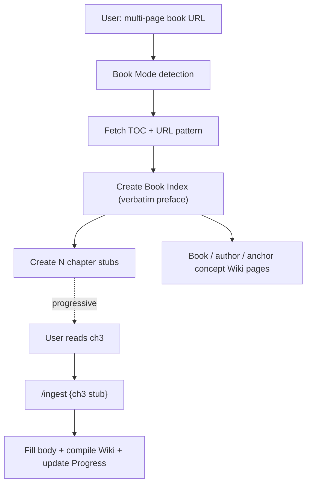

# /ingest — LLM Wiki Ingest

Ingest source material into the LLM Wiki. Follow CLAUDE.md rules strictly (YAML: 2 spaces, Body: TAB, wikilinks in YAML: quoted).

> **🧭 Prerequisite**: Read [[Core Context]] first (once per session). It establishes the user's 7 reuse axes and philosophy — ingest quality depends on it.

## Input

`$ARGUMENTS`

- If a **URL**: fetch the content with WebFetch, then process
- If a **file path** or **filename**: read that file from the vault (check `00. Inbox/` and its subfolders first)
- If **blank or "all"**: delegate to `/inbox` (scan all Inbox subfolders)
- If **raw text**: treat the argument itself as the source content
- If a **multi-page book/docs site** (mdBook, VitePress, GitBook, Docusaurus, ReadTheDocs, Nextra with 5+ chapters in sidebar/TOC): **use Book Ingest Mode** — see dedicated section below.

## Category Detection

Determine the Raw Source category in this priority order:
1. **Inbox subfolder** — file in `00. Inbox/01. Articles/` → category: Articles
2. **Web Clipper frontmatter** — `category` property in YAML → use as-is
3. **Content inference** — LLM analyzes content to determine best fit
4. **Default** — Articles (most common for web content)

Category → Path mapping:
| Category | Inbox Path | Raw Source Path |
|----------|------------|----------------|
| Articles | `00. Inbox/01. Articles/` | `10. Raw Sources/11. Articles/` |
| Papers | `00. Inbox/02. Papers/` | `10. Raw Sources/12. Papers/` |
| Books | — | `10. Raw Sources/13. Books/` |
| Transcripts | `00. Inbox/03. Transcripts/` | `10. Raw Sources/14. Transcripts/` |
| Clippings | `00. Inbox/04. Clippings/` | `10. Raw Sources/15. Clippings/` |

## Process (execute ALL steps in order)

### Step 0: Ask Collection Purpose (미래의 나에게 보내는 편지) — MANDATORY

**Before doing anything else**, ask the user ONE consolidated question — 미래의 나에게 보내는 편지:

> "미래의 내가 이 자료를 다시 볼 때 — 왜 수집했고, 어디에 쓸 예정인지 한 줄 남겨주세요.
> 재활용 축 참고: 사용자가 [[Core Context]] §2 에 정의한 5~9 개 축 (예: 학술 / 저술 / 강의 / 컨설팅 / 제품 / 에세이 / 커뮤니티)
> 예: '(3) 강의 — 4월 기업 임원 세미나 자료'"

Rules:
- Ask ONLY this question. Do not bombard the user with multiple questions.
- If the user explicitly says "알아서 판단해줘" or "자동으로" → infer the most likely axis from source content + [[Core Context]] §2 and state inference + reason explicitly. Still record in `collectionPurpose`.
- Save the user's answer verbatim into `collectionPurpose` (Raw Source frontmatter).
- **Batch mode** (`/ingest all`): ask once up front — "오늘 들어온 {N}개 소스, 전체를 하나의 목적으로 묶으시겠어요, 아니면 개별로 물을까요?". Respect user's choice.

### Step 0-a: Search Main Vault for Connections — MANDATORY when purpose given

Once the user provides purpose, search the (optional) mothership vault for related notes/concepts, as registered in [[Core Context]] §5. This becomes `mainVaultRelated`. Skip this step if no mothership is configured.

```
# Semantic search (preferred — user-scope qmd, cwd-independent)
mcp__qmd__query(
  searches=[
    {type: "vec", query: "<key concept 1 from source>"},
    {type: "vec", query: "<user's collectionPurpose keywords>"}
  ],
  intent="Find mothership notes related to this ingest for cross-vault linking"
)

# Keyword fallback
Grep(pattern="<key term>", path="{PATH_TO_YOUR_MOTHERSHIP_VAULT}", output_mode="files_with_matches", head_limit=20)
```

Filter to **2~5 highest-relevance notes**. Prefer:
1. Essays in `30. Permanent Notes/` (user's original thinking)
2. MOCs or 🏛 hub notes
3. CMDS category pages (`📚 N0N ...`)
4. Recent meeting/consulting notes if the purpose is teaching/consulting

Format each as: `"→ {your-mothership-vault-name}: {relative path from vault root}"`.

Show the user the candidate list, ask: **"이 중 연결할 노트를 골라주시거나, 추가로 생각나는 것 있으면 알려주세요. (그대로 진행하려면 'ok')"**

Record the final list in `mainVaultRelated` (Raw Source + relevant Wiki pages). Also identify the best-fit CMDS category (`📚 NNN ...`) and record as `mainVaultCmds`.

### Step 1: Analyze

Read the source content thoroughly. Extract:
- **Key topics/concepts** (3~8): abstract ideas worth a Concept page
- **Entities** (1~5): people, organizations, products, models
- **Practical guidance** (0~3): how-to content worth a Guide page
- **Key claims**: assertions that should be fact-tracked
- **Connections**: concepts that link to existing wiki pages

Before creating pages, read `index.md` to check what pages already exist. Prioritize **updating** existing pages over creating new ones.

### Step 2: Save Raw Source (Move, not Copy)

> [!warning] This is a **MOVE** operation, not a copy
> If the source originated from `00. Inbox/`, the Raw Source write is **step 1 of 2**. Step 2 is **deleting the Inbox original** after verbatim-preservation is verified. Skipping the delete leaves the file visible to `/inbox` and re-ingested next scan — observed failure mode.

Create the raw source file in `10. Raw Sources/{NN. category}/`:
- Filename: `YYYY-MM-DD-{Title}.md` (today's date)
- Category: Articles (web), Papers (academic), Books, Transcripts, Clippings
- **MANDATORY — Preserve original content verbatim in `## Original Content` section.** No exceptions, no summaries, no "redacted for brevity." Including embedded image URLs, YouTube links, customer quote blocks, citation lists. If the source is extremely long (e.g., >10K words), still preserve it — this is the immutable layer of the 3-Layer Architecture.
	- If the Inbox clipper already wraps the article body in `## Original Content`, copy that section verbatim.
	- If the source is a URL (WebFetch), preserve the fetched content.
	- Deduplicate only obvious clipper artifacts (e.g., customer-quote block repeated 3x due to clipper bug) and note the dedup in `## Ingest Notes`.
	- Images: keep the markdown `` lines even if CDN-hosted — the URL is part of the record.
- If from Web Clipper: carry over frontmatter (`source` URL, `author`, `date clipped`) into the raw source file
- Use the Category Detection rules above to determine the target subfolder

**Pre-flight checklist before moving on**:
- [ ] `## Original Content` section present
- [ ] Article body lines > 50 (or > 80% of Inbox body length for normal articles)
- [ ] Embedded images (``) preserved
- [ ] Embedded videos / media URLs preserved
- [ ] Customer quotes, citations, code blocks preserved verbatim
- [ ] Frontmatter has 7 required properties (type, aliases, description, author, date created, date modified, tags)

**Inbox cleanup (MANDATORY when source came from Inbox)**:

After the Raw Source file is written AND pre-flight checklist passes:

```bash
# Source determination rule
# Delete the Inbox file ONLY when the source originated from 00. Inbox/
# Do NOT delete when the source was a URL (WebFetch), external file path, or raw text — nothing to clean up.

rm "{vault-root}/00. Inbox/{subfolder}/{original-file.md}"
```

Matrix of source origin → cleanup action:
| Source origin | Action after Raw Source write |
|---------------|-------------------------------|
| `00. Inbox/NN. {category}/{file}.md` | **Delete** Inbox file |
| URL (WebFetch) | No file to delete |
| Absolute path outside Inbox | No delete — user-provided file |
| Raw text (prompt argument) | No file to delete |

**Edge cases**:
- If verbatim preservation check in Step 7 fails AFTER Inbox delete: the Inbox file is lost. Therefore, **delete only after all pre-flight checks pass**.
- If multiple Inbox files were batched into one Raw Source (rare): delete all consumed Inbox files. Document in `## Ingest Notes`.

Frontmatter template:
```yaml
---
type: raw-source
aliases:
  - {short name}
description: {English, 1-2 sentences}
author:
  - {original author}
date created: {today ISO 8601}
date modified: {today ISO 8601}
date ingested: {today ISO 8601}
tags:
  - raw-source
  - {topic tags}
source: {URL or reference}
category: {Articles|Papers|Books|Transcripts|Clippings}
status: ingested
source-vault: "{your-mothership-vault-name}"
collectionPurpose: {user's answer from Step 0 — verbatim}
mainVaultRelated:
  - "→ {your-mothership-vault-name}: {path to related note 1}"
  - "→ {your-mothership-vault-name}: {path to related note 2}"
mainVaultCmds: "[[📚 NNN {Category Name}]]"
---
```

**YAML 준수 체크**: `collectionPurpose`, `mainVaultRelated`, `mainVaultCmds` 는 CMDS camelCase 네이밍 (v2 신설 키). snake_case 금지.

### Step 3: Compile Wiki Pages

For each extracted topic/entity/guide, either **update** an existing page or **create** a new one:

**Concepts** (`20. Wiki/21. Concepts/`):
- Abstract ideas, techniques, methodologies, patterns
- Include: Overview, Details, Related links, Sources, Open Questions
- `confidence`: high (well-sourced) / medium (partial) / low (speculative)

**Entities** (`20. Wiki/22. Entities/`):
- People, organizations, products, models, tools
- Include: Overview, Details, key contributions/features, Related

**Guides** (`20. Wiki/23. Guides/`):
- How-to content, practical tutorials, tooling guides
- Include: step-by-step instructions, prerequisites, tips

**When updating existing pages**:
- Add new information under relevant sections
- Add new source to the `source` property list
- Add new cross-references to `related` property
- If new info contradicts existing: add `> [!warning] Contradiction` callout
- Update `date modified`

**Target: 10~15 wiki pages touched per ingest.**

**Quality control (v4)**:
- New Wiki pages default to `explored: false`
- Set `explored: true` only after a human or source-backed review loop has verified the page
- For `confidence: high` or synthesis-heavy pages, add:
	```markdown
	> [!note] Bias Check
	> Counter-argument: ...
	> Data gap: ...
	```

### Step 4: Connect

- Add `[[wikilinks]]` between all related pages
- Create or update relevant MOC in `20. Wiki/24. Maps/`
- Ensure no orphan pages (every new page linked from at least one other page)

### Step 5: Update index.md

- Add new pages to the appropriate category section (Concepts/Entities/Guides/Maps)
- Each entry: `- [[Page Name]] — one-line description`
- Update Stats table (counts)
- Add entry to Recent Ingests table

### Step 6: Update log.md

Append a new log entry (Karpathy-style prefix `## [YYYY-MM-DD] ingest | title`):
```markdown
## [{YYYY-MM-DD}] ingest | {source title}

- Source: [[{raw source filename}]]
- **Purpose**: {collectionPurpose verbatim}
- Mothership links: {mainVaultRelated count} — {top 1-2 paths}
- Pages created: [[page1]], [[page2]], ...
- Pages updated: [[page3]], [[page4]], ...
```

### Step 7: Review

After all writes are complete, do a quick health check:
- **Raw Source verbatim preservation check**: grep the new raw source for `^## Original Content` — must be present AND followed by substantive body (not just 1-2 lines). If source was from Inbox, compare line count to inbox file body BEFORE the Inbox delete in Step 2, to confirm no accidental summarization.
- **Inbox cleanup check (MANDATORY if source came from Inbox)**: verify the original Inbox file has been deleted. Run `ls "00. Inbox/{subfolder}/"` — the consumed file should NOT appear. If it still exists, delete it now (Step 2 requirement).
- Verify all new `[[wikilinks]]` point to existing pages
- Check that no duplicate pages were created
- Confirm index.md reflects the current state
- Report any open questions or knowledge gaps discovered

**Failure modes to watch for**:

1. **Summarization instead of verbatim**: summarizing the original content into "Key Takeaways" / "Core Thesis" sections INSTEAD OF preserving verbatim body. Summaries belong in Wiki pages, not Raw Sources. Raw Sources are the immutable source-of-truth layer — if verbatim content is missing, the Raw Source is corrupt regardless of how rich the summary is.

2. **Inbox residue**: writing the Raw Source but forgetting to delete the Inbox original. Symptom — next `/inbox` scan treats the same source as unprocessed and re-ingests it, creating duplicate Raw Sources. Mitigation — Step 2 Inbox cleanup is MANDATORY and Step 7 verifies it.

## Output

Summarize the ingest result:
1. Source: what was ingested (title, URL if applicable)
2. Raw Source: where saved
3. Pages created: list with one-line descriptions
4. Pages updated: list with what changed
5. Connections: key cross-references added
6. Open questions: gaps or contradictions discovered

---

## Book Ingest Mode (Multi-Page Sources) — Progressive Stubs

Activate this mode when the source is a **structured multi-page book or documentation site** (typical signals: a sidebar/TOC with ≥5 chapters, mdBook/VitePress/GitBook/Docusaurus/ReadTheDocs/Nextra frontends, or an explicit `book`/`docs` URL pattern). Standard `/ingest` dumps everything into one Raw Source; Book Mode creates a **navigable scaffold** — one Book Index file + N chapter stubs — and fills chapters progressively as the user reads them.

> **Why this is different**: Karpathy's LLM Wiki philosophy = "knowledge is compiled when read, not when scraped." Pre-ingesting 30 unread chapters = hoarding. Pre-creating 30 **stubs** = navigable future-compile targets, linked from the Index. Compile (fill verbatim + Wiki pages) only when the user actually reads each chapter.

### Step 0 + 0-a: same as standard (Purpose + Mothership search)

Still mandatory. Get one purpose answer covering the whole book.

### Step B-1: Fetch TOC + derive chapter URL pattern

```
WebFetch(url=<preface/readme/index URL>, prompt="Extract full TOC with chapter titles in their original order, preserve part groupings (Part/Section), return as JSON: [{part, ch, title, slug_hint}]")
```

Test URL pattern by fetching **2 chapter URLs** directly. Common patterns:
- mdBook: `/ch01-00-foo.html`, `/ch01-01-bar.html` or `/part1/ch01.html`
- VitePress/Docusaurus: `/ch01-foo/`, `/en/ch01-foo`
- GitBook: `/book/chapter-1/section-1`

Confirm the pattern matches reality before committing to naming.

### Step B-2: Create Book Index (1 Raw Source)

`10. Raw Sources/11. Articles/YYYY-MM-DD-{authorSlug}-{bookSlug}-book-index.md`

Contains:
- Full frontmatter (see stub frontmatter below but with `status: ingested` and **no `chapterNumber`**)
- **Verbatim** preface content in `## Original Content`
- `## TOC` — every chapter as `- [ ] [[stub filename]] — {TOC one-liner}` grouped by Part
- `## Reading Paths` — if author provides (e.g., role-based paths), preserve verbatim
- `## Progress Tracking` — table: `| Ch | Title | Status | Read on |`

### Step B-3: Create chapter stubs (N files)

For each chapter, create `10. Raw Sources/11. Articles/YYYY-MM-DD-{authorSlug}-{bookSlug}-ch{NN}-{slug}.md`:

```yaml
---
type: raw-source
status: stub                                # ← new status value
aliases:
  - "ch{NN} {English title}"
description: "Chapter {N} of {book} — {TOC one-liner}. Stub until read."
author:
  - "{book author}"
date created: {today}
date modified: {today}
date ingested: {today}                      # for stubs, = date scaffolded, not date read
tags:
  - raw-source
  - stub
  - {book-slug}
  - {topic tags from TOC}
source: "{direct chapter URL}"
category: Articles
bookIndex: "[[YYYY-MM-DD-{...}-book-index]]"   # ← new key
chapterPart: "{Part I / 第一篇 / etc.}"        # ← new key, preserve original language
chapterNumber: {N}                             # ← new key, integer
chapterPrev: "[[...ch{N-1}...]]"              # may be null for ch01
chapterNext: "[[...ch{N+1}...]]"              # may be null for last ch
collectionPurpose: "{inherited from book-level purpose}"
---

# {Ch{NN}: Full chapter title from TOC}

> [!info] Reading Status: Stub
> This chapter has not been read yet. Only the TOC one-liner is preserved. On reading, re-invoke `/ingest {this file path}` → verbatim body fill + Wiki page compile + `status: stub` → `completed` promotion.

## Source

- Original URL: {direct chapter URL}
- Book: [[YYYY-MM-DD-{...}-book-index]]
- Previous: [[...ch{N-1}...]] · Next: [[...ch{N+1}...]]

## TOC Preview

{the one-line summary from TOC, verbatim}

## Original Content

<!-- STUB: pending verbatim fill. Placeholder intentionally non-empty to satisfy validate-raw-source hook. -->

_This chapter body is empty while `status: stub`. Re-invoking `/ingest` on this file will fetch from the original URL and fill this section verbatim._

## Reading Notes

<!-- Notes, questions, wiki-promotion candidates added while reading -->
```

Pre-flight per stub:
- [ ] `## Original Content` section present (even as placeholder — required for hook)
- [ ] `status: stub` in frontmatter
- [ ] `source` = direct chapter URL (verified resolvable)
- [ ] `chapterNumber`, `chapterPart`, `bookIndex` set
- [ ] `chapterPrev` / `chapterNext` wikilinks point to existing stub files (or null for endpoints)
- [ ] No Wiki pages compiled yet for this chapter (that happens on promotion)

### Step B-4: Book-level Wiki pages (small set)

Compile only what's derivable from TOC + preface:

- **Entity**: `{Book Title (native)}` — the book itself
- **Entity**: `{Author Name}` — author
- **Entity** (optional): companion sites (e.g., visualization, discussion)
- **Concept(s)** (1~3): concepts the author names in the preface that are **anchor** to the whole book (e.g., "Agent Loop" as the book's anchor chapter)
- **Guide** (optional, 0~1): if preface itself contains a reusable methodology (e.g., reading paths)
- **MOC update**: link book index to relevant MOC

**Do NOT** pre-compile chapter-specific Wiki pages. Those appear at promotion time.

### Step B-5: Index + Log

- index.md Recent Ingests: `{N chapters scaffolded, M wiki pages}` format
- log.md: single entry documenting whole book scaffold + noting progressive compile plan

### Promotion Workflow (when user reads ch N)

Trigger: user runs `/ingest 2026-XX-XX-...-chNN-slug.md` OR describes the chapter in chat with intent to compile.

Steps:
1. Fetch chapter URL → verbatim body into `## Original Content` (replacing stub placeholder)
2. Flip `status: stub` → `status: completed` (or `reading` if partial)
3. Update `date modified`
4. Compile Wiki pages specific to this chapter (concepts/entities/updates to existing pages)
5. Update book index's Progress Tracking table: `- [ ]` → `- [x]`
6. Append log.md: `## [YYYY-MM-DD] promote | {book} ch{NN}`

### Frontmatter Keys Added by Book Ingest Mode

Keys introduced by this mode (camelCase per schema conventions):
- `bookIndex` — wikilink to the book index Raw Source
- `chapterNumber` — integer
- `chapterPart` — string, preserve source language
- `chapterPrev`, `chapterNext` — wikilinks, may be null
- `status: stub` — new enumerated value alongside `ingested`, `reading`, `completed`

### Hook Interaction

The `validate-raw-source.sh` PostToolUse hook enforces `## Original Content` presence. Book stubs **satisfy this by design** (placeholder block is non-empty). If the hook is upgraded to also check body substantiveness, it should exempt `status: stub`. Document this expectation here so future hook edits stay aware.

### Visual Pattern


