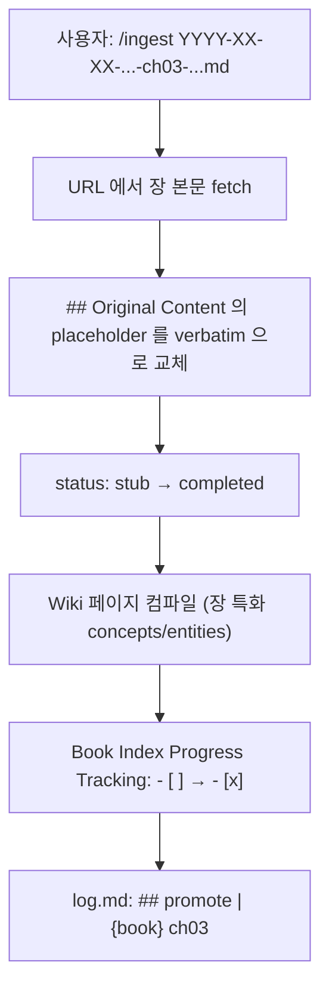

# Book Ingest Pattern

> [!tip] Key Insight
> **멀티 페이지 책을 한꺼번에 긁어오지 않는다.** TOC + preface 으로 **navigable scaffold** (1 Book Index + N stubs) 를 만들고, 사용자가 **실제로 읽는 장만** verbatim + Wiki 컴파일 로 승격. Karpathy 의 "지식은 스크랩이 아니라 독서 시점에 컴파일" 원칙의 구체화.

---

## Overview

**Book Ingest Pattern** 은 표준 `/ingest` 의 **변형 (variant)** 이다. 단일 URL/파일/텍스트용 표준 모드와 달리, 멀티 페이지 책·문서 사이트 (mdBook, VitePress, GitBook, Docusaurus, ReadTheDocs, Nextra — TOC 에 5+ 챕터) 를 대상으로 설계됨.

문제: 30 장짜리 책을 표준 `/ingest` 로 처리하면 두 가지 실패가 있음:
1. **한 파일에 전부** — 100K+ words, 가독성 붕괴, `## Original Content` 이 비대화
2. **30 파일 동시 ingest + 30 × Wiki 컴파일** — 읽지도 않은 내용이 Wiki 에 심어져 AI 요약이 human-curated knowledge 자리에 삽입되는 contamination 발생

해결: **Progressive Stubs** — navigable scaffold 만 지금 만들고, 독서 시점에 chapter-by-chapter 승격.

---

## Architecture

### Scaffold 단계 (지금)

```
10. Raw Sources/11. Articles/
├── YYYY-MM-DD-{author}-{book}-book-index.md       ← Book Index (verbatim preface)
├── YYYY-MM-DD-{author}-{book}-ch01-{slug}.md      ← stub
├── YYYY-MM-DD-{author}-{book}-ch02-{slug}.md      ← stub
├── ...
└── YYYY-MM-DD-{author}-{book}-ch{N}-{slug}.md     ← stub

20. Wiki/22. Entities/
├── {Book Title (native)}.md                        ← 책 자체
└── {Author Name}.md                                ← 저자

20. Wiki/21. Concepts/
└── {Anchor Concept from Preface}.md                ← 저자가 preface 에서 명시한 앵커 (선택)
```

**Book Index 내용**:
- Preface verbatim in `## Original Content`
- `## TOC` — N 장 `[[wikilink]]` 테이블 (편/파트로 그룹)
- `## Reading Paths` — 저자가 제시한 경로 (있으면) verbatim
- `## Progress Tracking` — `| Ch | Title | Status | Read on |` 테이블

**Chapter stub 내용**:
- Frontmatter: `status: stub`, `chapterNumber`, `chapterPart`, `bookIndex`, `chapterPrev`, `chapterNext`
- `## Source` — 원본 URL + 책 링크 + 이전/다음 장
- `## TOC Preview` — TOC 한 줄 요약 verbatim
- `## Original Content` — **placeholder block** (비어있지 않음, hook 통과용)
- `## Reading Notes` — 독서 중 메모 공간

### 승격 단계 (사용자 독서 시)

사용자가 `ch3` 을 읽을 때:



승격은 **개별 발생**. 사용자는 모든 장을 꼭 다 읽을 필요 없음 — 책의 3 장만 중요하면 3 장만 승격되고 나머지는 영구 stub 유지.

---

## Frontmatter Keys

Book Ingest 가 도입한 신규 frontmatter 키 (camelCase 준수):

| Key | 타입 | 용도 |
|-----|------|------|
| `status: stub \| reading \| completed \| ingested` | enum | 독서·컴파일 진행 상태 |
| `bookIndex` | wikilink | 소속 Book Index Raw Source |
| `chapterNumber` | int | TOC 기준 챕터 번호 |
| `chapterPart` | string | 편/파트 이름 (원문 언어 보존) |
| `chapterPrev` | wikilink\|null | 이전 챕터 |
| `chapterNext` | wikilink\|null | 다음 챕터 |

상세 정의: [[CLAUDE.md|Schema layer]] "Layer별 추가 프로퍼티 → Book Ingest 전용 키".

---

## Status Lifecycle

```
stub  →  reading  →  completed
 ↑                        ↓
 └────── ingested ←───────┘  (일반 ingest 는 stub 건너뛰고 바로 ingested)
```

- **`stub`** — scaffold 생성 직후. `## Original Content` 에 placeholder. Wiki 에 이 장 전용 페이지 없음.
- **`reading`** — 사용자가 장을 읽기 시작 (선택적 중간 상태). Reading Notes 에 메모 추가 중.
- **`completed`** — 본문 verbatim + Wiki 컴파일 완료. Book Index Progress 에서 체크.
- **`ingested`** — 표준 ingest 완료 상태 (Book Ingest 외 Raw Sources).

---

## 언제 Book Ingest 를 쓰는가

### ✅ 적합

- 명시적 TOC 를 가진 기술서 (mdBook, GitBook, VitePress 사이트)
- 5 장 이상의 구조화된 문서 (API reference, tutorial series)
- 저자가 "reading paths" 를 제시한 책 — 비선형 독서 지원
- 내가 **전체를 다 읽지 않을 수 있는** 긴 자료

### ❌ 부적합

- 단일 긴 에세이 (preamble 없이 chapter 없는 long-form) → 표준 ingest
- 학술 논문 (paper) → 표준 ingest (논문은 원래 단일 단위)
- 짧은 블로그 포스트 시리즈 (독립 포스트들) → 각각 표준 ingest
- 코드 저장소 (`src/` 분석) → 표준 ingest + 필요 시 파일별 분리 ingest

---

## 관련 원칙

### Progressive Disclosure 과의 유사성

Claude Code 의 Skills 이 YAML preview → body on demand 로 작동하듯, Book Ingest 는 **TOC preview → full chapter on read**. 같은 정신.

### Contamination Mitigation 과의 정렬

LLM 이 읽지도 않은 장을 요약해서 Wiki 에 심으면 **human-curated knowledge 의 자리에 AI 요약이 삽입** 되는 contamination 이 발생. Stub 은 이를 차단 — 실제 독서 후에만 Wiki 생성.

### [[LLM Wiki Pattern]] 의 "compile when read" 원칙 구체화

Karpathy: "Good answers can be filed back into the wiki as new pages." Book Ingest 는 이를 **독서 단위** 로 적용.

---

## Hook Interaction

- `validate-raw-source.sh` PostToolUse hook 은 `## Original Content` 섹션 존재를 강제.
- Stub 파일은 **placeholder block 으로 섹션 보존** → hook 통과.
- Hook 이 본문 substantiveness 까지 검사하도록 업그레이드되면 `status: stub` 를 예외 처리해야 함 (향후 hook 개선 과제).

---

## Related

- [[LLM Wiki Pattern]] — compile when read 원칙
- [[Ingest-Query-Lint Cycle]] — Book Ingest 는 Ingest 의 variant
- [[3-Layer Architecture]] — Raw Sources 레이어 내부 구조 다양화

---

## Open Questions

> [!question] Stub 의 수명 정책
> 1 년 이상 읽지 않은 stub 은 어떻게 처리하나? 자동 archive? `/lint` 에 "stale stub" 검사 추가 필요.

> [!question] Stub 삭제 vs Wiki 역링크
> 사용자가 stub 을 지웠는데 Book Index 와 다른 stub 의 `chapterPrev`/`chapterNext` 가 깨진다. Lint 에서 자동 복구 가능한지.

> [!question] Multi-language book 처리
> 같은 책이 여러 언어 판을 가진 경우 (예: 중국어 원문 + 영어 번역) 같은 Book Index 에 두 언어 TOC 를 나란히? 별도 Book Index 2 개?
